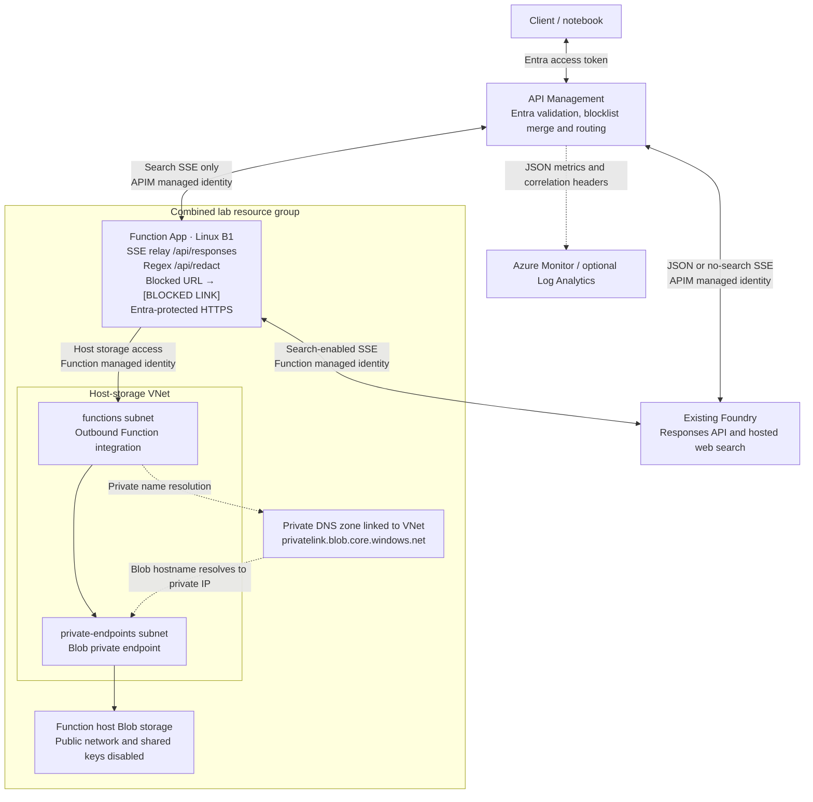
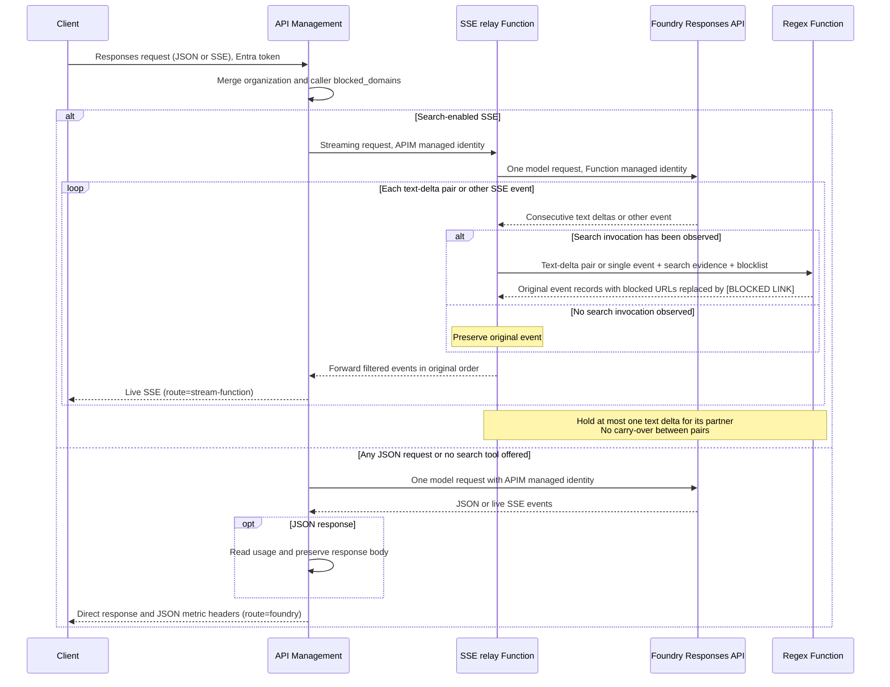

# Foundry web-search blocklist with regex URL redaction

This lab combines the search filters from
[ai-foundry-web-search-blocklist](../ai-foundry-web-search-blocklist/) with the
response inspection and protected Function pattern from
[responses-web-search-function](../responses-web-search-function/).

The **`/api/redact` Azure Function runs only after an actual `web_search_call`
output item or search-progress event in SSE**. A live `/api/responses` relay invokes
it for pairs of text deltas and single non-text SSE events. All non-streaming
requests go directly from APIM to Foundry and retain the original response body. The Function matches URL hostnames
against an escaped blocklist regex and replaces the entire matching URL with `[BLOCKED LINK]`.
It performs no model calls or other network requests.

```text
https://youtube.com/watch?v=123
[BLOCKED LINK]
```

Replacement removes the URL scheme, host, port, path, query, and fragment.
Link labels, markup, punctuation, spacing, and surrounding text stay intact.
All domains outside the blocklist remain allowed. JSON keeps the hosted-search
request blocklist and metric headers; regex response redaction applies only to SSE.

## Architecture and routing

APIM calls Foundry directly for JSON and requests without search. Search-enabled
SSE goes through a live relay in the same Function App as the redactor. The relay
uses the app's identity for Foundry and conditional calls to `/api/redact`. Easy
Auth permits APIM and the Function App identity. Host storage uses private VNet
connectivity; the Function App retains a public, authenticated HTTPS endpoint.



APIM reads usage from JSON responses and sets metric headers without rewriting
the body or calling a Function. SSE is never materialized in APIM: search-enabled SSE uses the live relay,
and requests without a search tool stream directly from Foundry.



A tool declaration, `tool_choice`, a prompt mentioning search, or a usage counter
is not enough to trigger the regex Function. Only SSE is eligible, and it requires
a `web_search_call` output item or actual search-progress event.
The redactor independently checks the invocation evidence. An unused search tool
still uses the SSE relay, but never calls `/api/redact`.

Hosted search runs inside Foundry. APIM inspects the resulting Responses output;
it does not intercept individual internal search-provider HTTP calls.

## Blocklist and regex behavior

[blocked-domains.json](blocked-domains.json) contains the organization blocklist:

```text
youtube.com, tiktok.com, huggingface.co, facebook.com, x.ai, spotify.com,
pinterest.com, perplexity.ai, netflix.com, weebly.com, repo.maven.apache.org
```

APIM adds these domains to every `web_search.filters.blocked_domains` array.
Caller entries remain, comparisons ignore case, and duplicate domains are removed.
Other tool settings and search filters remain intact. The Function combines the
caller domains with its own `ORGANIZATION_BLOCKED_DOMAINS` setting. Clients cannot
remove organization entries.

```json
{
  "input": "Search for Azure API Management SSE documentation.",
  "tools": [{
    "type": "web_search",
    "filters": {"blocked_domains": ["example.com"]}
  }],
  "tool_choice": "required",
  "stream": true
}
```

The regex uses `re.escape` for every blocklist entry and hostname boundaries:
`(?:^|\.)(blocked-domain-alternatives)$`. A domain matches itself and its
subdomains, ignoring case and a trailing dot. For example,
`https://news.youtube.com/watch?v=123#start` becomes `[BLOCKED LINK]`, while
`https://notyoutube.com`, `https://youtube.com.other.example`, and
`https://good.example/?q=youtube.com` stay unchanged. Each complete matching URL is
removed and replaced by the literal marker, including any credentials, port,
path, query, and fragment. The marker is unchanged on subsequent passes.

The filter handles absolute URLs, protocol-relative URLs, `www` links, schemeless
links with paths, Markdown destinations/reference links, HTML link attributes,
and structured URL fields. It matches IDNA names and common percent/HTML-encoded
hostnames while preserving allowed URLs exactly. Request blocklists should
use DNS hostnames or punycode, without schemes, ports, paths, or regex syntax.

In SSE, redaction applies to response string values, including answer text, citation
URLs, and hosted-search source URLs. Response IDs, output items, usage, and
metadata remain present. Citation offsets are adjusted for any change in text length after URL replacement.
No LLM rewrites the answer, and there is no second model request.

Plain domain names in prose are preserved. The filter does not follow redirects,
inspect images, or identify deliberately obfuscated names. A replaced URL field
contains `[BLOCKED LINK]`, which is a placeholder rather than a navigable source URL.

## Streaming behavior

| Request/result | SSE behavior | Regex Function called? |
| --- | --- | --- |
| No `web_search` tool offered | Direct live Foundry SSE | No |
| Tool offered but not invoked | Relay original events immediately | No |
| Actual search invocation observed | Regex consecutive text-delta pairs; flush unmatched deltas before other events | Yes, once per pair or single event |

After search starts, consecutive `response.output_text.delta` events for the same
message and content part are filtered in non-overlapping pairs. The relay holds
one delta until its partner arrives, joins their text for regex matching, then
returns both original SSE events in order. A URL spanning the pair becomes one
`[BLOCKED LINK]`; its placeholder stays in the first event and the second retains
any following text. IDs, sequence numbers, content indexes, and event counts are
preserved. An unmatched delta is filtered on its own before a non-text event,
a different content part, or an upstream comment. Terminal events flush it before
completion. Unused tools and events before search remain unchanged.

For example, `https://you` plus `tube.com/a` in one pair becomes `[BLOCKED LINK]`.
There is no carry-over between pairs: a URL spanning the second event of one pair
and the first of the next can still escape detection. URLs spanning three or more
deltas, or interrupted by other event types, can also be missed. Paths or queries
arriving in a later pair can remain, and a partial blocked hostname can be
replaced before a later pair adds an allowed suffix. Complete `done` and terminal
snapshots are filtered separately and can differ from concatenated deltas.
Citation offsets are corrected within complete text snapshots; standalone
annotation offsets still refer to the original text.

The relay assembles incomplete transport frames to preserve JSON and UTF-8. Each
frame and each redaction request (including both events) is limited to 2 MB;
oversized pairs fail with an SSE error. It never collects the full response.
Pairing adds a one-delta wait plus the regex HTTP call. `x-response-redaction-window: 2`
identifies this mode; the existing `buffered: false` headers mean no full-response
buffering, while one text delta can be waiting for its partner.

Malformed/truncated streams and failed redaction calls end with an SSE error,
without forwarding the affected raw event. Already-delivered events remain at
the client. Require `response.completed`; HTTP 200 alone does not prove completion.

## Metrics and authentication

All JSON responses expose `x-response-metrics` (`web_search_count`,
`total_tokens`) and `x-response-metrics-status`. For SSE, final usage arrives in
`response.completed`; headers cannot contain values that are not yet known.
The relay sets `x-response-metrics-status: streamed`. Search counts come from
`tool_usage.web_search.num_requests`; original token usage and response IDs remain
unchanged. No separate usage-reporting API is required in this lab.

`x-lab-route` is `foundry` for every JSON response and for no-tool SSE, or
`stream-function` for search-enabled SSE. `x-lab-initial-buffered: false` means
there is no separate initial request stage. APIM still reads a preserved JSON
body to extract metrics. It sets `x-lab-filter: skipped` for JSON.
The SSE relay sets `x-lab-filter: conditional-regex` before it knows whether search
will run; observe search events to determine invocation. APIM adds
`x-response-request-id` for correlation.

The same metric map is used for JSON and the terminal SSE usage comparison:

```text
x-response-metrics: {"web_search_count":3,"total_tokens":120}
x-response-metrics-status: reported
```

Unavailable values are `null`; status is `reported`, `partial`, or `unavailable`.
JSON bodies, IDs, citations, and links are returned as supplied by Foundry.

APIM diagnostics log JSON metrics and correlation/filter headers without body
logging. Set `LAB_LOG_ANALYTICS_WORKSPACE_ID` to export GatewayLogs to an existing
workspace. Streaming usage remains available in the terminal SSE event.

Clients authenticate to APIM using Entra. APIM's identity calls Foundry and the
Function App. Easy Auth permits APIM and the app's own identity, so the SSE relay
can call the separate regex route. Both identities have Foundry inference access;
the app identity also accesses private host storage. The regex handler itself
makes no model or network calls. No Function keys, storage account keys, or
publishing passwords are used.

## Deploy and run

1. Use Python 3.12+, Azure CLI with `az login`, and an existing Foundry deployment
   supporting Responses and hosted `web_search`. The default is `gpt-5.6-luna`.
2. Deployment requires Contributor plus RBAC Administrator (or Owner), and
   permission to create Entra app registrations/service principals.
3. From this lab directory, run `uv sync --group dev`, copy [.env.example](.env.example)
   to `.env`, and configure Foundry. Review [blocked-domains.json](blocked-domains.json).
4. Open [ai-foundry-web-search-blocklist-function.ipynb](ai-foundry-web-search-blocklist-function.ipynb),
   select the lab's `.venv` kernel, and run the cells in order.
5. Run [clean-up-resources.ipynb](clean-up-resources.ipynb) when finished.

Set `APIM_SERVICE_ID` to add this lab's API to an existing gateway. The notebook
reuses its system-assigned identity and existing Foundry inference role when
available. Without that setting, it creates a dedicated APIM service. The Linux
B1 plan, Function App, and storage are deployed into the lab's own resource group;
the notebook also creates three secret-free Entra registrations. Foundry and an
optional Log Analytics workspace are reused. Creating a new APIM service can take
30–60 minutes, and retained resources incur charges. The Function is published
with Entra-authenticated ZIP deployment and a package containing Linux Python dependencies.

[main.bicep](main.bicep) supports `existingApimName`, `existingApimResourceGroup`,
and `existingApimSubscriptionId`; [apim-api.bicep](apim-api.bicep) deploys the API
in the selected gateway's resource group. `createFoundryRoleAssignment=false`
reuses APIM's existing inference role. The streaming relay's Function identity
always receives its own Foundry role. Cleanup removes
this lab's API from a reused gateway while retaining the gateway and its
pre-existing role assignments.

If upgrading the previous version of this example, rerun infrastructure deployment
and publish the Function together. Live SSE requires the new `/api/responses`
relay route, its Foundry role, and permission to call `/api/redact` as itself. Incremental deployments do not remove the old Function's
Foundry role assignment; the cleanup notebook discovers assignments for both lab
identities. Retain `.lab-state.json` for cleanup.

## Validation and limits

```bash
uv run --group dev pytest -q tests
az bicep build --file main.bicep --outfile /tmp/blocklist-regex-function.json
```

Tests cover literal regex matching, domain boundaries, complete URL replacement,
encoded hostnames, citation offsets in complete snapshots, actual tool detection,
live delivery before completion, fragmented SSE framing, paired text deltas,
unused tools, redactor failures, and policy routing. The notebook includes live
JSON and SSE checks plus authentication tests. Local tests do not execute Azure APIM expressions
or Easy Auth; deployment is required for those checks.

This is a stateless text lab: no conversations, previous response IDs, background
mode, or custom/preview tools. APIM limits request bodies to 64 KiB, model output
to 4096 tokens. JSON metric extraction materializes the body in APIM using
`preserveContent: true`; it does not apply the Function redaction-envelope limit.
Individual SSE frames and redaction envelopes are limited to 2 MB. APIM uses 180-second upstream timeouts.
Long research responses can exceed these limits. `store=false` means the original
response ID is retained for correlation, not server-side retrieval.

The notebook packages Linux x86-64 Python 3.12 wheels with `uv` under
`.python_packages/lib/site-packages`, including when the notebook runs on Windows.
Azure remote builds are disabled, so publication does not extract a Python SDK
on the B1 host. Only runtime source and dependencies enter `function.zip`.

The combined lab keeps host storage private. A dedicated VNet subnet integrates
the Function with a Blob private endpoint and private DNS zone; its managed
identity authorizes storage access. APIM continues to call the public Function
endpoint protected by Entra authentication. The VNet, private endpoint, and DNS
resources belong to the lab resource group and are removed by its cleanup notebook.
