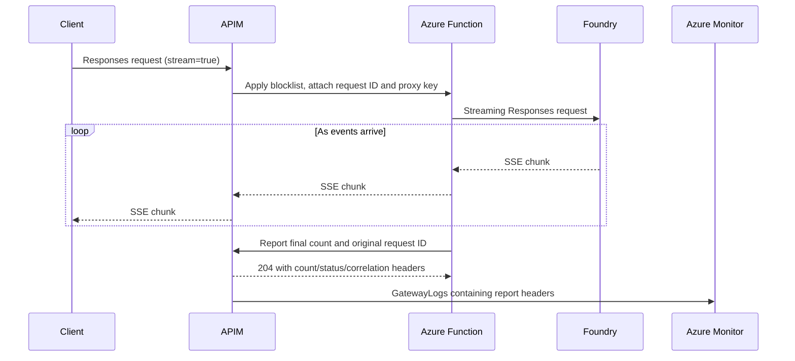

# Foundry web-search blocklist and search accounting with API Management

This lab adds organization domains to `tools[].filters.blocked_domains` and
counts the searches exposed by Azure OpenAI Responses API web-search calls.
JSON responses carry an APIM-logged `x-web-search-count`. Streaming requests use
an HTTP-only Azure Function that forwards SSE events as they arrive and reports
the final count to a protected APIM API.

## Architecture



JSON requests go directly from APIM to Foundry. The existing APIM service,
Foundry account/model, and Log Analytics workspace are reused.

| New component | Purpose |
| --- | --- |
| Function `func-wsc-<suffix>-http` | Python HTTP-streaming proxy and direct usage reporting |
| Plan `plan-wsc-<suffix>` | Linux B1, one instance, Always On |
| APIM backend `<apiName>-streaming-proxy` | Calls the Function with a private `x-proxy-key` |
| APIM API `<apiName>-usage` | Receives usage reports and logs their response headers |
| Subscription `<apiName>-proxy-reporter` | Dedicated credential for the reporting API |

`<apiName>` defaults to `web-search-blocklist`; `<suffix>` is derived from the
resource-group ID and API name. No storage account, queue, or private networking
resources are provisioned.

## Prerequisites and setup

- Python 3.12+, VS Code/Jupyter, and `uv sync` run at the repository root.
- Azure CLI authenticated with permission to deploy APIM APIs, a Function App,
  and an App Service plan, plus permission to assign roles on Foundry.
- Existing APIM and Foundry resources, a model deployment supporting
  `web_search`, and web search enabled in the subscription.
- An APIM subscription key scoped to this lab's API or all APIs.

1. Copy [.env.example](.env.example) to `.env` and set `APIM_SERVICE_ID`,
   `APIM_SUBSCRIPTION_KEY`, and `AZURE_OPENAI_DEPLOYMENT`.
2. Set `BACKEND_ID` (or `APIM_BACKEND_ID`) to reuse an existing Foundry backend.
   Otherwise, set `AZURE_OPENAI_ENDPOINT` to create a backend on existing APIM.
   A backend ID takes precedence over endpoint/key settings.
3. Open [ai-foundry-web-search-blocklist.ipynb](ai-foundry-web-search-blocklist.ipynb)
   and run the cells in order. Choose unused `APIM_API_NAME` / `APIM_API_PATH`
   values for the first deployment; later runs update the same API.

The loader reads the repository-root `.env`, then the lab `.env`; process
variables take precedence. Select another file with `load_config(env_file=...)`
or `LAB_ENV_FILE`. An explicit file replaces the default file search.

The helper enables APIM's system-assigned identity when needed and grants
**Cognitive Services OpenAI User** at Foundry account scope. It preserves existing
identities and assignments. Both APIM and the Function use Entra authentication
for `https://ai.azure.com`. An optional `AZURE_OPENAI_API_KEY` enables key
authentication only when creating a backend from an endpoint.

The Foundry account is discovered by hostname in the APIM subscription. Set
`AZURE_OPENAI_RESOURCE_ID` for a different subscription or custom hostname.
For backend pools, set `AZURE_OPENAI_RESOURCE_IDS`, `BACKEND_RESPONSES_PATH`, and
`STREAMING_PROXY_FOUNDRY_RESPONSES_URL`; the Function uses that concrete URL.
Other optional settings are documented in [.env.example](.env.example).

| Backend URL ends in | Default relative Responses path |
| --- | --- |
| Resource hostname | `/openai/v1/responses` |
| `/openai` | `/v1/responses` |
| `/openai/v1` | `/responses` |

### Proxy deployment and configuration

`deploy(config, prepared)` provisions [streaming-proxy.bicep](streaming-proxy.bicep)
under `<apiName>-proxy-function`, grants the Function access to Foundry, and
publishes the five runtime files from `proxy/` using a remote Python build.
It stops/starts the Function and checks the authenticated route before deploying
[main.bicep](main.bicep) under `<apiName>` to configure APIM routing and logging.
The default client endpoint is `https://<apim>/web-search/openai/v1/responses`.

The Function uses Python 3.12, Functions v4, `PYTHON_ENABLE_INIT_INDEXING=1`, and
`AzureWebJobsSecretStorageType=files`. Host keys use the platform filesystem;
`AzureWebJobsStorage` and Azure Files connection settings are omitted.

**This is an experimental, HTTP-only, single-instance Dedicated-plan setup.**
[Microsoft documents storage as required for Function Apps](https://learn.microsoft.com/en-us/azure/azure-functions/storage-considerations).
The lab has been verified with live streaming, a matching APIM usage report,
and a full app stop/start, but this does not establish platform support.
Do not add storage/queue/timer/Durable bindings or assume Consumption, Flex, or
scale-out support. Revalidate after runtime updates.

The HTTP trigger uses anonymous host authorization and validates APIM's private
`x-proxy-key` in the handler. Host/admin keys remain separate. The usage API
checks the proxy's dedicated subscription ID, so ordinary client keys, including
all-APIs keys, cannot submit trusted reports.

The B1 plan incurs charges while retained. Health checks use `/api/healthz`.
Function execution is limited to ten minutes; upstream reads time out after
180 seconds of inactivity. The relay accepts requests up to 2 MiB and emits
keepalive comments every 15 seconds while waiting for upstream data.
`ENABLE_STREAMING_PROXY=false` keeps SSE forwarding but disables trusted
streaming accounting. Running Bicep directly requires publishing the Function,
granting backend access, and supplying its URL/key separately.

## Blocklist behavior

The policy appends these domains only to tools whose type is exactly `web_search`:

```text
youtube.com, tiktok.com, huggingface.co, facebook.com, x.ai, spotify.com,
pinterest.com, perplexity.ai, netflix.com, weebly.com, repo.maven.apache.org
```

Existing entries and their order are preserved; only missing domains are added,
using case-insensitive comparison. `allowed_domains`, other filters/tools, and
unrelated request fields remain intact. For example, an existing blocklist of
`["example.com", "youtube.com"]` keeps those entries and adds the other ten domains.
Reapplying the policy does not add duplicates.

Missing/null filters and blocklists are initialized. Malformed web-search
filters or blocklists return HTTP 400. Requests without `web_search` bypass
validation and rewriting. Preview tool types are unchanged because they do not
support this filtering contract. Domain filtering controls search sources, not
arbitrary domain mentions in model output.

Use APIM's portal **Test** tab with tracing and inspect the **Backend request
body** to verify merging; citations alone do not prove policy behavior.

## Search counts and streaming

The count sums completed `web_search_call` items with `action.type == "search"`:

- Count entries in `action.queries`, including repeated queries.
- If `queries` is absent/null, count a nonempty `action.query` as one.
- Exclude `open_page`, `find_in_page`, sources, and citations.
- Missing/malformed details or unfinished calls make usage unavailable, not zero.

Two queries in one call plus one query in another report three searches. This
measures activity exposed by the service, not authoritative billing usage.

| Response | Logged count |
| --- | --- |
| JSON | Original response: `x-web-search-count`, status `reported` |
| SSE | Initial response: status `deferred`, no count; separate report: count and status `proxy-reported` |
| Incomplete accounting | Status `unavailable`, no count |

Both requests return `x-web-search-request-id` for correlation. HTTP headers are
sent before a stream completes, so the final count cannot be added to the
original response headers while preserving live delivery.

APIM uses `forward-request buffer-response="false"` and a separate SSE policy
branch with no response-body references. An early return inside a body-reading
expression can still cause APIM to buffer. Inherited body logging, response
validation, or caching may also buffer and should be disabled for this API.

The Function forwards the original bytes and counts only the terminal
`response.completed`, `response.incomplete`, or `response.failed` snapshot.
Progress events are not counted again. It retains at most one SSE event (8 MiB);
exceeding that limit leaves forwarding intact but makes usage unavailable.
Disconnects before a valid terminal snapshot also report unavailable usage.
Disconnects after the snapshot preserve the known count.

After forwarding the received events, the Function posts to
`/<APIM_API_PATH>-usage/reports`. Reporting retries transient failures up to
three times within 15 seconds. This can delay HTTP EOF, but not model events.
There is no durable queue: process crashes or sustained reporting failures can
lose reports. Failed attempts log the request ID/count in the Function log.
Deduplicate retries by request ID and monitor deferred requests without a report
after allowing for log ingestion delay.

Notebook section 8 displays early SSE events, search progress, text deltas, and
a local count for comparison with the APIM record. High reasoning effort may
delay text even while early events are arriving. The notebook does not submit
usage reports.

### Log the headers in APIM

Both APIs have Azure Monitor diagnostics with 100% sampling. They log
`x-web-search-count`, `x-web-search-count-status`, and `x-web-search-request-id`
from frontend response headers. Frontend/backend body logging is disabled.

APIM must also export **GatewayLogs**. Reuse an existing export or set
`APIM_LOG_ANALYTICS_WORKSPACE_ID` to an existing workspace resource ID and redeploy.
This adds the service-wide diagnostic setting `<apiName>-gateway-logs`; it does
not create a workspace.

Query the resource-specific table, substituting your API names if different:

```kusto
ApiManagementGatewayLogs
| where ApiId in ("web-search-blocklist", "web-search-blocklist-usage")
| extend SearchCountStatus = tostring(ResponseHeaders["x-web-search-count-status"])
| extend WebSearches = tolong(ResponseHeaders["x-web-search-count"])
| extend OriginalRequestId = tostring(ResponseHeaders["x-web-search-request-id"])
| where isnotempty(OriginalRequestId) and SearchCountStatus != "deferred"
| summarize arg_max(TimeGenerated, *) by OriginalRequestId
| project TimeGenerated, OriginalRequestId, WebSearches, SearchCountStatus
```

Exclude unavailable rows from sums and monitor them separately. Existing exports
using `AzureDiagnostics` need a query adapted to that schema.

## Troubleshooting and local checks

Azure CLI errors include captured Azure error details. On Windows, install Azure
CLI and restart VS Code/Jupyter if it cannot be found. After editing `src/lab.py`,
restart the kernel and rerun setup before retrying deployment.

For `PermissionDenied`, check the backend APIM actually uses; it may differ from
the current `.env`. These helpers inspect it and grant the existing identity
access without changing routing:

```python
from src.lab import get_deployed_backend, grant_deployed_backend_access
print(get_deployed_backend(config))
backend_access = grant_deployed_backend_access(config)
```

Allow time for role propagation. For subscription-key errors, check the key's
API scope. Run local checks from this directory:

```bash
python -m pip install -r proxy/requirements.txt
python -m unittest proxy.test_app -v
az bicep build --file main.bicep --outfile /tmp/web-search-blocklist.json
az bicep build --file streaming-proxy.bicep --outfile /tmp/web-search-proxy.json
```

Tests cover early forwarding, counts, disconnects, authentication, and report
retries. Deployment is required to validate APIM policy execution and log ingestion.

## Files and cleanup

| Files | Purpose |
| --- | --- |
| [main.bicep](main.bicep), [policy.xml](policy.xml) | Client API, blocklist, JSON accounting, and logging |
| [streaming-proxy.bicep](streaming-proxy.bicep), [streaming-routing.xml](streaming-routing.xml) | Function infrastructure and APIM streaming route |
| [usage-policy.xml](usage-policy.xml) | Authenticate and log proxy usage reports |
| [proxy/function_app.py](proxy/function_app.py), [proxy/host.json](proxy/host.json) | Function routes and host settings |
| [proxy/app.py](proxy/app.py), [proxy/accounting.py](proxy/accounting.py) | Streaming relay, query counting, and reporting |
| [proxy/requirements.txt](proxy/requirements.txt) | Function runtime dependencies |
| [src/lab.py](src/lab.py) | Configuration, deployment, and request helpers |

Use [clean-up-resources.ipynb](clean-up-resources.ipynb) to preview and delete this
lab's API, any lab-created backend, proxy, plan, usage API, and reporter
subscription. It also reads earlier deployment records so old proxy apps and
storage/network resources can be removed; drain any legacy queued reports first.
Incremental redeployment alone does not delete those older resources.

Cleanup retains the resource group, APIM, reused backend, Foundry/model resources,
identities/role assignments, deployment records, and shared Azure Monitor settings.

## References

- [Responses API web-search domain filtering](https://learn.microsoft.com/en-us/azure/foundry/openai/how-to/web-search#domain-filtering)
- [Foundry Agent Service web search](https://learn.microsoft.com/en-us/azure/foundry/agents/how-to/tools/web-search?pivots=python)
- [Server-sent events in APIM](https://learn.microsoft.com/en-us/azure/api-management/how-to-server-sent-events)
- [Azure Functions storage requirements](https://learn.microsoft.com/en-us/azure/azure-functions/storage-considerations)
- [Function key storage settings](https://learn.microsoft.com/en-us/azure/azure-functions/functions-app-settings#azurewebjobssecretstoragetype)
