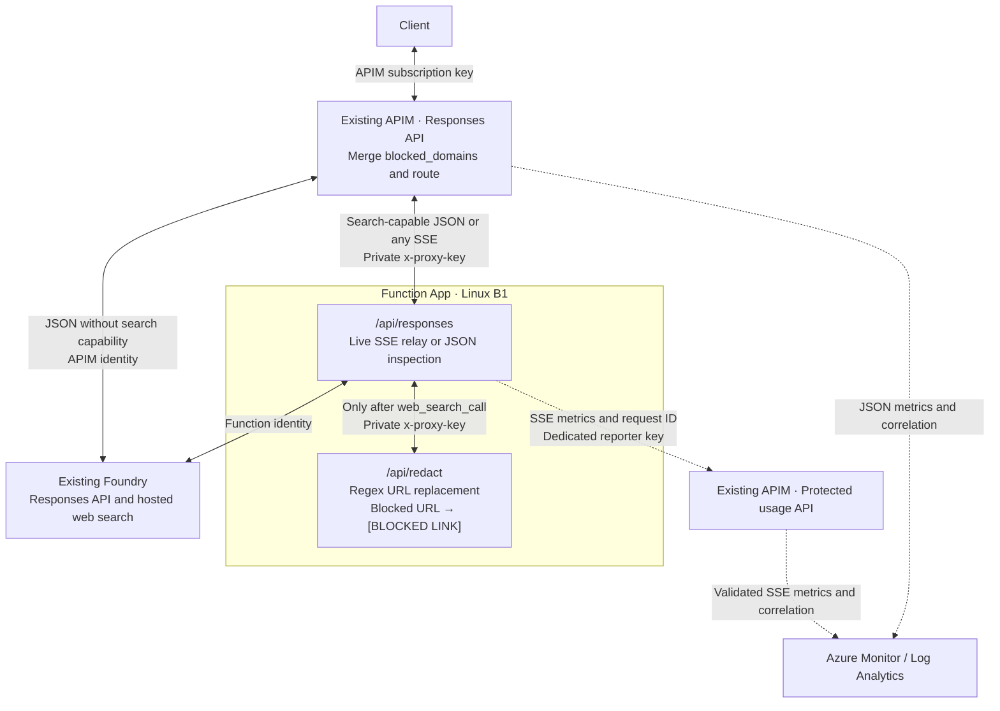
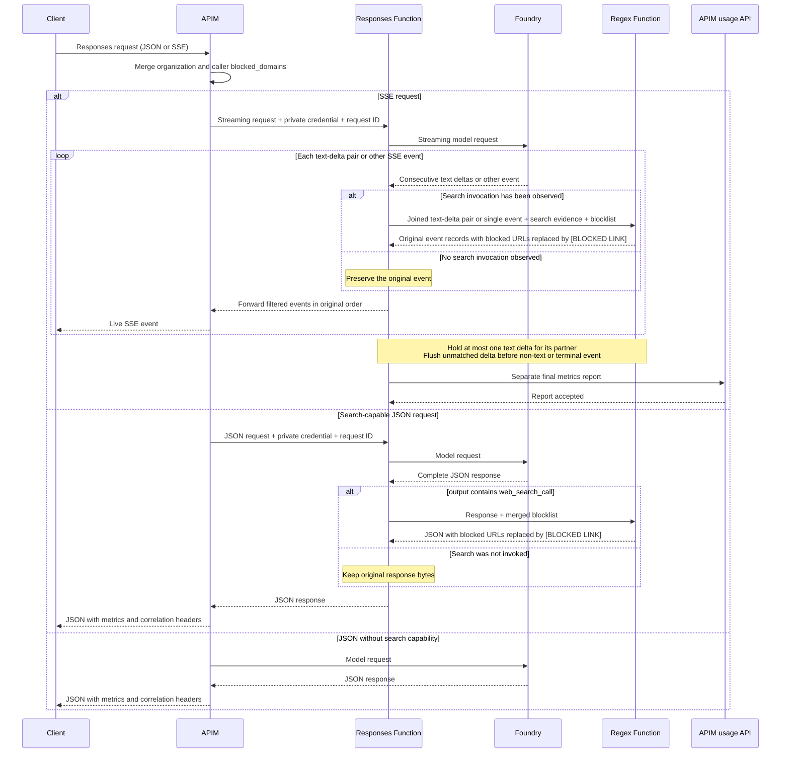

# Foundry web-search blocklist and search accounting with API Management

This lab appends organization domains to `tools[].filters.blocked_domains`, then
replaces blocked URLs with `[BLOCKED LINK]` in responses that actually invoke web search. A separate
`/api/redact` Azure Function applies regex matching to URL hostnames:
`https://youtube.com/watch?v=1` becomes `[BLOCKED LINK]`.
Blocked URL paths, queries, and fragments are removed along with the hostname.
Allowed URLs, prose, whitespace, link labels, and surrounding markup stay intact.
JSON and streaming responses retain the original response IDs and usage.

## Architecture

The Responses proxy and regex redactor run in one Function App. Solid arrows
carry requests and responses; dotted arrows show usage reporting and logging.



Routing depends on both the request's search capability and its response mode.
JSON redaction requires a completed response containing `web_search_call`.
SSE redaction starts when an actual search invocation event is observed.



The proxy and regex function are separate HTTP triggers in the same Function App.
Only the regex function is conditional on an actual `web_search_call` output item
or SSE search-progress event; a declaration or usage counter does not trigger it. It performs no model or network
calls. Both routes validate the private `x-proxy-key` credential.

JSON requests without search tools or stored context go directly to Foundry.
All streaming requests use the live metrics relay. Search-capable streams
(including preview tools or stored context) call the regex Function for each
event once search is observed. JSON search responses are inspected in full.
The redactor also checks the actual invocation defensively. The existing APIM service, Foundry
account/model, and Log Analytics workspace are reused.

| New component | Purpose |
| --- | --- |
| Function App `func-wsc-<suffix>-http` | `/api/responses` proxy, `/api/redact` regex function, and health route |
| Plan `plan-wsc-<suffix>` | Linux B1, one instance, Always On |
| APIM backend `<apiName>-streaming-proxy` | Calls the proxy with a private `x-proxy-key` |
| APIM API `<apiName>-usage` | Validates numeric metric maps and logs response headers |
| Subscription `<apiName>-proxy-reporter` | Dedicated credential for the reporting API |

`<apiName>` defaults to `web-search-blocklist`; `<suffix>` is derived from the
resource-group ID and API name. No additional redaction plan, storage account,
queue, or private networking resources are provisioned.

## Prerequisites and setup

- Python 3.12+, VS Code/Jupyter, and `uv sync` run at the repository root.
- Azure CLI authenticated with permission to deploy APIM APIs, a Function App,
  and an App Service plan, plus permission to assign roles on Foundry.
- Existing APIM and Foundry resources, a model deployment supporting
  `web_search`, and web search enabled in the subscription.
- An APIM subscription key scoped to this lab's API or all APIs.

1. Copy [.env.example](.env.example) to `.env` and set `APIM_SERVICE_ID`,
   `APIM_SUBSCRIPTION_KEY`, and `AZURE_OPENAI_DEPLOYMENT`.
2. Set `BACKEND_ID` (or `APIM_BACKEND_ID`) to reuse an existing Foundry backend.
   Otherwise, set `AZURE_OPENAI_ENDPOINT` to create a backend on existing APIM.
   A backend ID takes precedence over endpoint/key settings.
3. Open [ai-foundry-web-search-blocklist.ipynb](ai-foundry-web-search-blocklist.ipynb)
   and run the cells in order. Choose unused `APIM_API_NAME` / `APIM_API_PATH`
   values for the first deployment; later runs update the same API.

The loader reads the repository-root `.env`, then the lab `.env`; process
variables take precedence. Select another file with `load_config(env_file=...)`
or `LAB_ENV_FILE`. An explicit file replaces the default file search.

The helper enables APIM's system-assigned identity when needed and grants
**Cognitive Services OpenAI User** at Foundry account scope. It preserves existing
identities and assignments. Both APIM and the Function use Entra authentication
for `https://ai.azure.com`. An optional `AZURE_OPENAI_API_KEY` enables key
authentication only when creating a backend from an endpoint.

The Foundry account is discovered by hostname in the APIM subscription. Set
`AZURE_OPENAI_RESOURCE_ID` for a different subscription or custom hostname.
For backend pools, set `AZURE_OPENAI_RESOURCE_IDS`, `BACKEND_RESPONSES_PATH`, and
`STREAMING_PROXY_FOUNDRY_RESPONSES_URL`; the Function uses that concrete URL.
Other optional settings are documented in [.env.example](.env.example).

| Backend URL ends in | Default relative Responses path |
| --- | --- |
| Resource hostname | `/openai/v1/responses` |
| `/openai` | `/v1/responses` |
| `/openai/v1` | `/responses` |

### Proxy deployment and configuration

`deploy(config, prepared)` provisions [streaming-proxy.bicep](streaming-proxy.bicep)
under `<apiName>-proxy-function`, grants the Function access to Foundry, and
publishes the runtime files from `proxy/` using a remote Python build.
It stops/starts the Function and checks both authenticated routes, including a synthetic URL-replacement test, before deploying
[main.bicep](main.bicep) under `<apiName>` to configure APIM routing and logging.
The default client endpoint is `https://<apim>/web-search/openai/v1/responses`.

The Function uses Python 3.12, Functions v4, `PYTHON_ENABLE_INIT_INDEXING=1`, and
`AzureWebJobsSecretStorageType=files`. Host keys use the platform filesystem;
`AzureWebJobsStorage` and Azure Files connection settings are omitted.

**This is an experimental, HTTP-only, single-instance Dedicated-plan setup.**
[Microsoft documents storage as required for Function Apps](https://learn.microsoft.com/en-us/azure/azure-functions/storage-considerations).
The lab has been verified with live streaming, a matching APIM usage report,
and a full app stop/start, but this does not establish platform support.
Do not add storage/queue/timer/Durable bindings or assume Consumption, Flex, or
scale-out support. Revalidate after runtime updates.

The HTTP trigger uses anonymous host authorization and validates APIM's private
`x-proxy-key` in the handler. Host/admin keys remain separate. The usage API
checks the proxy's dedicated subscription ID, so ordinary client keys, including
all-APIs keys, cannot submit trusted reports.

The B1 plan incurs charges while retained. Health checks use `/api/healthz`.
Function execution is limited to ten minutes; upstream reads time out after
180 seconds of inactivity. The relay accepts requests up to 2 MiB and emits
keepalive comments every 15 seconds while waiting for upstream data.
`ENABLE_STREAMING_PROXY=false` disables both regex redaction and trusted streaming
metrics; keep the default `true` for the complete lab. Running Bicep directly requires publishing the Function,
granting backend access, and supplying its URL/key separately.

## Blocklist behavior

[blocked-domains.json](blocked-domains.json) supplies both the APIM filter and the
regex Function configuration. The policy appends these domains only to tools whose
type is exactly `web_search`:

```text
youtube.com, tiktok.com, huggingface.co, facebook.com, x.ai, spotify.com,
pinterest.com, perplexity.ai, netflix.com, weebly.com, repo.maven.apache.org
```

Existing entries and their order are preserved; only missing domains are added,
using case-insensitive comparison. `allowed_domains`, other filters/tools, and
unrelated request fields remain intact. For example, an existing blocklist of
`["example.com", "youtube.com"]` keeps those entries and adds the other ten domains.
Reapplying the policy does not add duplicates.

Missing/null filters and blocklists are initialized. Malformed web-search
filters or blocklists return HTTP 400. Requests without `web_search` bypass
validation and rewriting. Preview tool types are unchanged because they do not
support this filtering contract. The regex function separately replaces complete matching URLs with `[BLOCKED LINK]` in answer text,
citations, and source metadata. Plain domain mentions in prose are left intact.

Regex matching escapes each blocked hostname and requires an exact hostname or
subdomain boundary. `youtube.com.evil.example` and `notyoutube.com` are unaffected.
Each matched URL is replaced in full by `[BLOCKED LINK]`, including its scheme,
subdomains, port, path, query, and fragment. Surrounding text, link labels, markup,
spacing, and punctuation remain intact. Matching supports case differences, IDNA, URL-encoded
hosts, Markdown links, HTML links, and structured URL fields. There is no allowlist
in the regex function: all other domains are allowed. Citation offsets are updated
when replacement changes the text length.

After search starts, consecutive `response.output_text.delta` events for the same
message and content part are filtered in non-overlapping pairs. The relay holds
one delta until its partner arrives, joins their text for regex matching, then
returns both original SSE events in order. A URL spanning the pair becomes one
`[BLOCKED LINK]`; its placeholder stays in the first event and the second retains
any following text. IDs, sequence numbers, content indexes, and event counts are
preserved. An unmatched delta is filtered on its own before a non-text event,
a different content part, or an upstream comment. Terminal events flush it before
completion. Unused tools and events before search remain unchanged.

For example, `https://you` plus `tube.com/a` in one pair becomes `[BLOCKED LINK]`.
There is no carry-over between pairs: a URL spanning the second event of one pair
and the first of the next can still escape detection. URLs spanning three or more
deltas, or interrupted by other event types, can also be missed. Paths or queries
arriving in a later pair can remain, and a partial blocked hostname can be
replaced before a later pair adds an allowed suffix. Complete `done` and terminal
snapshots are filtered separately and can differ from concatenated deltas.
Citation offsets are corrected within complete text snapshots; standalone
annotation offsets still refer to the original text.

The relay assembles incomplete transport frames to preserve JSON and UTF-8. Each
frame and each redaction request (including both events) is limited to 2 MB;
oversized pairs fail with an SSE error. It never collects the full response.
Pairing adds a one-delta wait plus the regex HTTP call. `x-response-redaction-window: 2`
identifies this mode; the existing `buffered: false` headers mean no full-response
buffering, while one text delta can be waiting for its partner.

A malformed/truncated frame or redactor failure ends the stream with an SSE
error. Already-delivered events cannot be recalled; clients must require
`response.completed`. The stream starts with `x-response-buffered: false` and
`x-response-redaction: conditional` for search-capable requests (`skipped` otherwise).
These headers are sent before the eventual invocation is known. JSON responses
use `x-response-buffered: true` and `x-response-redaction: regex|skipped`; their
buffer is limited to 16 MiB and their redaction envelope to 2 MB.

Use APIM's portal **Test** tab with tracing and inspect the **Backend request
body** to verify merging; citations alone do not prove policy behavior.

## Search counts and streaming

`web_search_count` comes directly from `tool_usage.web_search.num_requests` in
the response body. For streaming, the proxy reads the same field under
`response` in the terminal SSE event. For example, `"num_requests": 6` reports
`"web_search_count": 6` for either response mode.

Only nonnegative integers within the metric limit are accepted. An explicit zero
reports zero; a missing, null, or malformed count reports `null`. Output items,
queries, sources, and citations are not used to infer a count. Token metrics
remain independently available from `usage`.

| Response | Logged result |
| --- | --- |
| JSON | Original response: `x-response-metrics` with `web_search_count` and `total_tokens`; status `reported`, `partial`, or `unavailable` |
| SSE | Original response: `x-response-metrics-status: deferred`; separate report: `x-response-metrics` with all configured metrics |
| Missing metric | That metric's JSON value is `null`; other metrics remain available |

JSON responses and streaming reports use the same response headers and JSON metric format.
The current proxy registry and JSON policy both report `web_search_count` and `total_tokens`:

```text
x-response-request-id: <original gateway request ID>
x-response-metrics: {"web_search_count":3,"total_tokens":120}
x-response-metrics-status: proxy-reported
```

APIM derives status as `reported` for a JSON response or `proxy-reported` for a
streaming report when every value is available, `partial` when some are null, or
`unavailable` when all are null. The reporter cannot choose that status. The
original response and report share `x-response-request-id`.
HTTP headers precede the completed stream, so final metrics must be logged on the
separate report to preserve live delivery.

The metric and correlation headers replace the earlier `x-web-search-count`,
`x-web-search-count-status`, and `x-web-search-request-id` contract for all examples.
Redeploy the Function and both policies together and update queries/clients to
the new names. For an existing proxy already using the current headers, redeploy
just the main API and diagnostics with `reuse_streaming_proxy=True` as shown below.

If streaming returns **HTTP 400: Missing gateway request ID**, the Function did
not receive a valid `x-response-request-id`. A partial upgrade can leave the
Function using this header while APIM still sends `x-web-search-request-id`.
APIM must generate the ID with `context.RequestId`; adding a client header does
not repair the deployed policy or its logging contract.

When the current Function and usage API are already deployed, finish the APIM
update without rebuilding or restarting the Function:

```python
import importlib
from src import lab

importlib.reload(lab)
deployment = lab.deploy(config, prepared, reuse_streaming_proxy=True)
print(deployment["properties"]["provisioningState"])
```

This reuses the existing Function URL/key and verifies the current request-ID header and regex URL replacement without making a model
request. An older deployment without the redactor must first be published with
`lab.deploy(config, prepared)`. It updates the main
APIM API and diagnostics; it does not update Function code or the usage API.
If the Function or usage API also needs updating, rerun notebook section 3 with
`lab.deploy(config, prepared)`. Retry the streaming cell after deployment succeeds.

APIM uses `forward-request buffer-response="false"` and a separate SSE policy
branch with no response-body references. An early return inside a body-reading
expression can still cause APIM to buffer. Inherited body logging, response
validation, or caching may also buffer and should be disabled for this API.

For ordinary live streams, the Function forwards the original bytes and extracts metrics only from terminal
`response.completed`, `response.incomplete`, or `response.failed` snapshots.
Progress events are not counted again. It retains at most one SSE event (8 MiB);
exceeding that limit leaves forwarding intact but makes all metrics unavailable.
Disconnects before a valid terminal snapshot also report null values.
Disconnects after the snapshot preserve the known metrics. A failing extractor
makes only its own value unavailable; it does not interrupt the stream.

For live streams, after forwarding the received events, the Function posts to
`/<APIM_API_PATH>-usage/reports`. Reporting retries transient failures up to
three times within 15 seconds. This can delay HTTP EOF, but not model events.
Buffered search responses report before returning their filtered events.
There is no durable queue: process crashes or sustained reporting failures can
lose reports. Failed attempts log the request ID/metrics in the Function log.
Deduplicate retries by request ID and monitor deferred requests without a report
after allowing for log ingestion delay.

Notebook sections 4–6 print the gateway metric headers alongside each JSON response.
Section 8 displays the same header names, early SSE events, search progress, text
deltas, and local metrics serialized as JSON for comparison with the APIM record.
High reasoning effort may delay text even while early events are arriving. The notebook does not submit
usage reports.

### Add another completion metric

Edit `METRIC_EXTRACTORS` in [proxy/metrics.py](proxy/metrics.py). Each extractor
receives the complete terminal JSON event and returns an `int`, `float`, or
`None`. For example, add cached input tokens to the registry:

```python
METRIC_EXTRACTORS["cached_input_tokens"] = (
    lambda event: event["response"]["usage"]["input_tokens_details"]["cached_tokens"]
)
```

Missing fields and extractor exceptions produce `null`. Keep extractors fast and
local; they run as the terminal event is inspected. For another JSON SSE event
schema, change `TERMINAL_EVENTS` and the extractor paths. The supplied transport
still targets the configured Responses endpoint with JSON `stream: true` requests
and recognizes terminal event types in each event's JSON `type` field.

The relay, reporting policy, and logged header list require no metric-specific
changes. Redeploy the Function to publish registry edits. To include the same
additional metrics in direct JSON responses, update the metric map and extraction
in `policy.xml` as well, including its unavailable/error maps, then redeploy the
main API. Metric names must match
`[a-z][a-z0-9_]{0,63}`; include units in names where useful, such as `duration_ms`.
A report supports 1–32 numeric/null values, finite magnitudes up to `1e18`, and a
4096-byte JSON header. Booleans, strings, arrays, and nested objects are rejected.
Token extractors accept only nonnegative integers; custom gauges can be signed
or fractional. Values outside the contract become unavailable.

### Log the headers in APIM

Both APIs have Azure Monitor diagnostics with 100% sampling and log the same
frontend response headers: `x-response-metrics`, `x-response-metrics-status`, and
`x-response-request-id`. Streaming responses initially log the correlation ID and
`deferred` status; their final metric maps arrive in the separate report.
Frontend/backend body logging is disabled.

APIM must also export **GatewayLogs**. Reuse an existing export or set
`APIM_LOG_ANALYTICS_WORKSPACE_ID` to an existing workspace resource ID and redeploy.
This adds the service-wide diagnostic setting `<apiName>-gateway-logs`; it does
not create a workspace.

Query the resource-specific table, substituting your API names if different:

```kusto
ApiManagementGatewayLogs
| where ApiId in ("web-search-blocklist", "web-search-blocklist-usage")
| extend MetricsStatus = tostring(ResponseHeaders["x-response-metrics-status"])
| extend OriginalRequestId = tostring(ResponseHeaders["x-response-request-id"])
| where isnotempty(OriginalRequestId) and MetricsStatus != "deferred"
| extend Metrics = parse_json(tostring(ResponseHeaders["x-response-metrics"]))
| summarize arg_max(TimeGenerated, *) by OriginalRequestId
| project TimeGenerated, OriginalRequestId, Metrics, MetricsStatus
```

Exclude null metric values from sums and monitor them separately; a partial
report may still contain usable metrics. Existing exports
using `AzureDiagnostics` need a query adapted to that schema.

## Troubleshooting and local checks

Azure CLI errors include captured Azure error details. On Windows, install Azure
CLI and restart VS Code/Jupyter if it cannot be found. The setup and deployment
cells reload `src.lab` to pick up helper changes in a running kernel. If an older
notebook reports that `hostingMode` is not a template parameter, rerun the updated
deployment cell; the current helper no longer sends that removed parameter.

A connection reset during Azure CLI's deployment-status polling does not mean
the upload failed. The helper checks the new deployment record and retries status
reads without uploading again. It rejects failed builds, old successes, and
ambiguous concurrent deployments.

To resume a publication from an earlier failed notebook run, find its ID with
`az functionapp log deployment list --resource-group <group> --name <function>`.
Then run:

```python
import importlib
from src import lab
importlib.reload(lab)
deployment = lab.deploy(config, prepared, resume_proxy_deployment_id="<deployment-id>")
```

Resume uses that already-published package; it does not publish newer local code.
The helper verifies the deployment is successful and active, restarts/checks the
Function, and finishes APIM configuration.

If `ResponseMetrics` cannot be imported after updating the proxy code, run the
notebook's **Compare metrics from the completed response** cell. It reloads both
proxy modules and uses the existing `streamed_event` without another model request.

For `PermissionDenied`, check the backend APIM actually uses; it may differ from
the current `.env`. These helpers inspect it and grant the existing identity
access without changing routing:

```python
from src.lab import get_deployed_backend, grant_deployed_backend_access
print(get_deployed_backend(config))
backend_access = grant_deployed_backend_access(config)
```

Allow time for role propagation. For subscription-key errors, check the key's
API scope. Run local checks from this directory:

```bash
uv pip install -r proxy/requirements.txt pytest pytest-asyncio
python -m pytest proxy src/test_publishing.py --asyncio-mode=auto -q
az bicep build --file main.bicep --outfile /tmp/web-search-blocklist.json
az bicep build --file streaming-proxy.bicep --outfile /tmp/web-search-proxy.json
```

Tests cover early forwarding, custom metrics, partial results, parser limits,
disconnects, authentication, and report retries. Deployment is required to validate APIM policy execution and log ingestion.

## Files and cleanup

| Files | Purpose |
| --- | --- |
| [main.bicep](main.bicep), [policy.xml](policy.xml) | Client API, blocklist, JSON accounting, and logging |
| [streaming-proxy.bicep](streaming-proxy.bicep), [streaming-routing.xml](streaming-routing.xml) | Function infrastructure and APIM streaming route |
| [usage-policy.xml](usage-policy.xml) | Authenticate and log proxy usage reports |
| [proxy/function_app.py](proxy/function_app.py), [proxy/host.json](proxy/host.json) | Function routes and host settings |
| [proxy/app.py](proxy/app.py), [proxy/accounting.py](proxy/accounting.py) | Generic streaming relay, bounded SSE parser, and reporting |
| [proxy/search.py](proxy/search.py) | Buffer search-capable responses and invoke the redactor only after actual search |
| [proxy/redaction.py](proxy/redaction.py), [proxy/filtering.py](proxy/filtering.py), [proxy/processing.py](proxy/processing.py) | Regex Function, URL replacement, citation offsets, and redacted SSE events |
| [blocked-domains.json](blocked-domains.json) | Organization domains used by both APIM and the regex Function |
| [proxy/metrics.py](proxy/metrics.py) | Terminal event types and metric extractor registry |
| [proxy/requirements.txt](proxy/requirements.txt) | Function runtime dependencies |
| [src/lab.py](src/lab.py) | Configuration, deployment, and request helpers |

Use [clean-up-resources.ipynb](clean-up-resources.ipynb) to preview and delete this
lab's API, any lab-created backend, proxy, plan, usage API, and reporter
subscription. It also reads earlier deployment records so old proxy apps and
storage/network resources can be removed; drain any legacy queued reports first.
Incremental redeployment alone does not delete those older resources.

Cleanup retains the resource group, APIM, reused backend, Foundry/model resources,
identities/role assignments, deployment records, and shared Azure Monitor settings.

## References

- [Responses API web-search domain filtering](https://learn.microsoft.com/en-us/azure/foundry/openai/how-to/web-search#domain-filtering)
- [Foundry Agent Service web search](https://learn.microsoft.com/en-us/azure/foundry/agents/how-to/tools/web-search?pivots=python)
- [Server-sent events in APIM](https://learn.microsoft.com/en-us/azure/api-management/how-to-server-sent-events)
- [Azure Functions storage requirements](https://learn.microsoft.com/en-us/azure/azure-functions/storage-considerations)
- [Function key storage settings](https://learn.microsoft.com/en-us/azure/azure-functions/functions-app-settings#azurewebjobssecretstoragetype)

## Verify regex behavior locally

From this lab directory, run:

```bash
python -m pytest proxy src/test_publishing.py --asyncio-mode=auto -q
```

Tests cover complete URL replacement, allowed hosts, URL encodings, citation offsets,
authentication, actual-tool detection, JSON/SSE parity, fragmented upstream
streams, and delivery/reporting behavior. Install `pytest` and `pytest-asyncio`
in the Python environment used for these checks.
