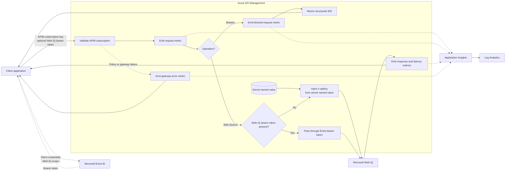

# APIM ❤️ Microsoft Web IQ

## [Microsoft Web IQ Usage Tracking lab](web-iq.ipynb)

This lab places Azure API Management in front of the [Microsoft Web IQ](https://webiq.microsoft.ai/documentation/overview/) Web Search and Browse APIs. Clients authenticate to APIM with subscription keys. For Web IQ authentication, APIM either injects its secret API key or passes through an optional Microsoft Entra ID bearer token. APIM blocks Browse with a structured `403` before any backend call and emits custom usage metrics to Application Insights.

### What you'll learn

- Store the Web IQ API key as a secret APIM named value.
- Optionally authenticate Web IQ with a Microsoft Entra ID app-only token.
- Proxy Web Search without exposing the upstream credential.
- Block Browse before APIM sends a request to Web IQ.
- Attribute usage to APIM subscriptions and operations.
- Query request volume, response status, and latency in Application Insights.

The policy records bounded dimensions only. It does not log search queries, response content, Web IQ API keys, or APIM subscription keys.

### Prerequisites

- [Microsoft Web IQ access](https://webiq.microsoft.ai/documentation/overview/) and an API key from Web IQ Profile Management. Web IQ is currently limited access.
- Optional for [Entra ID authentication](https://webiq.microsoft.ai/documentation/authentication/#entra-id): an app registration client ID bound in Web IQ Profile Management, its tenant ID, and a client secret.
- [Python 3.12 or later](https://www.python.org/).
- [VS Code](https://code.visualstudio.com/) with the [Jupyter extension](https://marketplace.visualstudio.com/items?itemName=ms-toolsai.jupyter).
- [uv](https://docs.astral.sh/uv/) — run `uv sync` at the repository root.
- An Azure subscription with Contributor + RBAC Administrator, or Owner, permissions.
- [Azure CLI](https://learn.microsoft.com/cli/azure/install-azure-cli) installed and authenticated.

### 🚀 Get started

Open [web-iq.ipynb](web-iq.ipynb) and run the steps in order.

### 🗑️ Clean up resources

When finished, run [clean-up-resources.ipynb](clean-up-resources.ipynb) to remove the lab resource group and avoid further charges.
