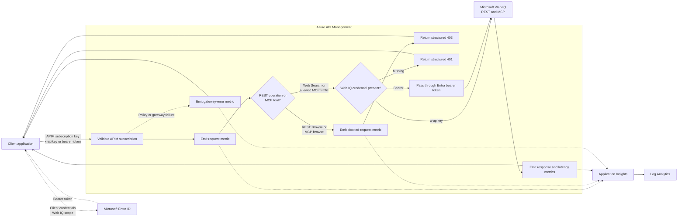

# APIM ❤️ Microsoft Web IQ

## [Microsoft Web IQ Usage Tracking and MCP lab](web-iq.ipynb)

This lab places Azure API Management in front of the [Microsoft Web IQ](https://webiq.microsoft.ai/documentation/overview/) REST and [MCP](https://webiq.microsoft.ai/documentation/mcp/) endpoints. Clients use APIM subscription keys for usage attribution and provide either a Web IQ `x-apikey` header or a Microsoft Entra ID bearer token for upstream authentication. APIM does not create or inject an upstream credential. It blocks Browse through both REST and MCP with a structured `403` before any backend call and emits custom usage metrics to Application Insights.

### What you'll learn

- Pass a caller-provided Web IQ API key through APIM without storing it at the gateway.
- Optionally authenticate Web IQ with a Microsoft Entra ID app-only token instead.
- Strip the APIM subscription credential before forwarding requests upstream.
- Connect an MCP client to Web IQ through APIM's streamable HTTP endpoint.
- Block Browse REST requests and MCP tool calls before APIM sends them to Web IQ.
- Attribute usage to APIM subscriptions, operations, and MCP tools.
- Query request volume, response status, and latency in Application Insights.

The policy records bounded dimensions only. It does not log search queries, response content, Web IQ API keys, or APIM subscription keys.

REST and MCP examples parse results according to the official [Web Response schema](https://webiq.microsoft.ai/documentation/api-reference/web/#web-response).

### Prerequisites

- [Microsoft Web IQ access](https://webiq.microsoft.ai/documentation/overview/) and an API key from Web IQ Profile Management. Web IQ is currently limited access.
- Optional for [Entra ID authentication](https://webiq.microsoft.ai/documentation/authentication/#entra-id): a system managed ID bound in Web IQ Profile Management, its tenant ID, and a client secret.
- [Python 3.12 or later](https://www.python.org/).
- [VS Code](https://code.visualstudio.com/) with the [Jupyter extension](https://marketplace.visualstudio.com/items?itemName=ms-toolsai.jupyter).
- [uv](https://docs.astral.sh/uv/) — run `uv sync` at the repository root.
- An Azure subscription with Contributor + RBAC Administrator, or Owner, permissions.
- [Azure CLI](https://learn.microsoft.com/cli/azure/install-azure-cli) installed and authenticated.

### 🚀 Get started

Open [web-iq.ipynb](web-iq.ipynb) to deploy the lab and explore both REST and MCP.

Then run [web-iq-mcp-responses.ipynb](web-iq-mcp-responses.ipynb) to test the APIM-hosted Web IQ MCP tool with the Azure OpenAI Responses API using dotenv connection strings.

### 🗑️ Clean up resources

When finished, run [clean-up-resources.ipynb](clean-up-resources.ipynb) to remove the lab resource group and avoid further charges.
