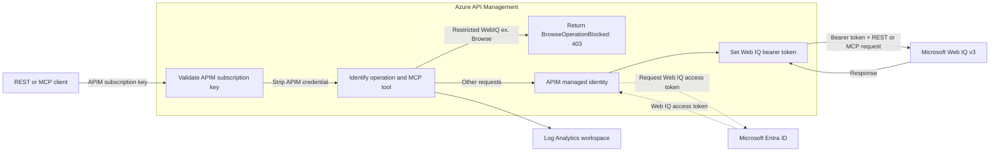
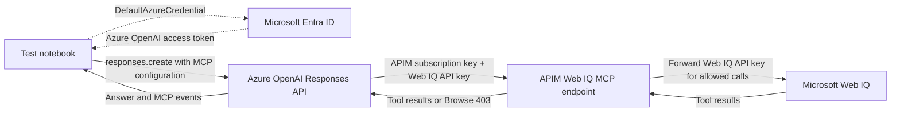

# APIM ❤️ Microsoft Web IQ

## [Microsoft Web IQ Usage Tracking and MCP lab](web-iq.ipynb)

This lab places Azure API Management (APIM) in front of the [Microsoft Web IQ](https://webiq.microsoft.ai/documentation/overview/) REST and [Model Context Protocol (MCP)](https://webiq.microsoft.ai/documentation/mcp/) endpoints. It demonstrates how a shared gateway can attribute web-grounding usage to individual consumers, enforce an operation restriction, and expose usage and latency metrics through Application Insights.

Each client supplies **two credentials**: an APIM subscription key identifying the consuming team, and a Web IQ API key or Microsoft Entra ID bearer token authenticating the upstream request. The deployed policy forwards the caller-provided Web IQ credential. Although the shared APIM module creates a managed identity, this lab's policy does not use it to acquire Web IQ tokens.

Start with [web-iq.ipynb](web-iq.ipynb) to deploy the infrastructure and test REST and MCP. Then optionally use [web-iq-mcp-responses.ipynb](web-iq-mcp-responses.ipynb) to let an Azure OpenAI model call the gateway's remote MCP endpoint.

### What you'll learn

- Separate APIM consumer identification from Web IQ authentication.
- Compare usage across the `research-team` and `support-team` APIM subscriptions.
- Forward Web IQ API keys or app-only Entra ID tokens without configuring an upstream secret in APIM.
- Discover and invoke Web IQ tools over streamable HTTP MCP.
- Block the Browse REST operation and MCP tool before either reaches Web IQ.
- Query requests, blocked calls, response codes, gateway errors, and latency by subscription and operation.
- Validate remote MCP calls made by the Azure OpenAI Responses API.

### Architecture

The diagram shows the target flow with APIM managed identity acquiring a Web IQ access token. The current policy and notebook examples still use caller-provided Web IQ credentials.



The deployment creates an APIM instance, two consumer subscriptions, a Web IQ backend and API, an Application Insights resource with dimensional custom metrics enabled, and a Log Analytics workspace. Web IQ is an external service; the deployment does not provision a Web IQ account or key. The optional Responses API notebook also uses an existing Azure OpenAI deployment.

### Folder contents

| File | Purpose |
| --- | --- |
| [web-iq.ipynb](web-iq.ipynb) | Deploy the lab, test Web Search, optionally authenticate with Entra ID, exercise MCP, and query telemetry. |
| [web-iq-mcp-responses.ipynb](web-iq-mcp-responses.ipynb) | Test Web IQ remote MCP through an existing Azure OpenAI Responses API deployment. |
| [main.bicep](main.bicep) | Compose shared infrastructure modules and configure the backend, API, policy, and diagnostics. |
| [openapi.json](openapi.json) | Define Web Search, Browse, and MCP operations and their stable operation IDs. |
| [policy.xml](policy.xml) | Handle credentials, classify MCP traffic, block Browse, forward requests, and emit metrics. |
| [clean-up-resources.ipynb](clean-up-resources.ipynb) | Remove the lab resource group using the shared cleanup helper. |

The notebooks use [shared/utils.py](../../shared/utils.py) and the repository's [Python environment](../../pyproject.toml). The deployment notebook generates a local `params.json`. An optional `.env` stores local configuration. Both filenames are ignored by Git.

### Prerequisites

- Access to [Microsoft Web IQ](https://webiq.microsoft.ai/documentation/overview/) and an API key from Web IQ Profile Management. The notebooks describe Web IQ as a limited-access service; confirm your account can use Web Search and the MCP `web` tool.
- [Python 3.12 or later](https://www.python.org/) and [uv](https://docs.astral.sh/uv/).
- [VS Code](https://code.visualstudio.com/) with the [Jupyter extension](https://marketplace.visualstudio.com/items?itemName=ms-toolsai.jupyter), or an equivalent notebook environment.
- [Azure CLI](https://learn.microsoft.com/cli/azure/install-azure-cli), authenticated to the intended tenant and subscription.
- An Azure subscription with the lab's documented Contributor + RBAC Administrator, or Owner, permissions, and availability for the selected APIM SKU and region.

For the optional Web IQ Entra ID example, also prepare an app registration with a client credential and bind its **Application (client) ID** in Web IQ Profile Management. For the Responses API notebook, you need an existing Azure OpenAI deployment supporting Responses and remote MCP, plus the **Cognitive Services OpenAI User** role for the identity used by `DefaultAzureCredential`.

### 🚀 Get started

#### 1. Prepare the environment

From the repository root (`C:\repo\AI-Gateway` on Windows or `/mnt/c/repo/AI-Gateway` in WSL), run:

```bash
uv sync
az login
az account set --subscription "<subscription-id>"
az account show
```

Open [web-iq.ipynb](web-iq.ipynb) and select the repository's `.venv` Python interpreter as the kernel: `.venv/bin/python` on Linux/WSL or `.venv\Scripts\python.exe` on Windows. Run its cells with `labs/web-iq` as the working directory so relative imports and Bicep paths resolve correctly.

The root environment includes `requests`, `msal`, `python-dotenv`, `pandas`, Azure identity libraries, the OpenAI SDK, and the pinned `mcp==1.21.2` package. This lab has no separate dependency installation.

#### 2. Supply the Web IQ credential

The initialization cell loads dotenv settings, reads `WEBIQ_API_KEY`, and prompts with `getpass` if the variable is absent. To use a local configuration file, create `labs/web-iq/.env` with:

```dotenv
WEBIQ_API_KEY="<web-iq-api-key>"
```

The deployment parameters contain no Web IQ credential. Keep `.env` local; if you use the interactive prompt, the key is held in the notebook process without being written to a configuration file.

#### 3. Review the deployment settings

Edit the initialization cell before deploying if you need different names, a different region, or another supported SKU.

| Notebook setting | Default | Purpose |
| --- | --- | --- |
| `deployment_name` | `web-iq` | Azure resource-group deployment name. |
| `resource_group_name` | `lab-web-iq` | Resource group created for the lab. |
| `resource_group_location` | `westus2` | Region for the deployed resources. |
| `apim_sku` | `Basicv2` | APIM pricing tier. Check regional availability before changing it. |
| `web_iq_api_path` | `web-iq` | Gateway URL prefix for all operations. |
| `apim_subscriptions_config` | `research-team`, `support-team` | Consumer subscriptions used in the sample requests and metrics. |

The Bicep parameters are `apimSku`, `apimSubscriptionsConfig`, `webIqApiPath`, and `webIqServiceUrl`. The upstream service URL defaults to `https://api.microsoft.ai/v3`. The notebook supplies the first three parameters; direct Bicep deployments must supply subscription configuration to create the two sample consumers, because the template's array default is empty.

APIM and monitoring resources incur Azure charges while deployed. Web IQ usage and the optional Azure OpenAI calls may incur separate charges under your service agreements.

#### 4. Deploy and run the examples

Run the main notebook in order. It verifies the active Azure subscription, creates the resource group, writes `params.json`, and deploys [main.bicep](main.bicep). Wait for the deployment to complete before running the request cells.

The output retrieval cell loads the gateway URL, Application Insights name, API path, and APIM subscription keys. It displays the subscription keys masked to their final four characters. For use in another client, retrieve a key from the APIM resource's **Subscriptions** page. APIM subscription IDs used in telemetry are resolved from those keys; clients do not send the raw subscription ID.

The remaining cells send Web Search requests for both teams, optionally use Entra ID, discover MCP tools, invoke `web`, attempt blocked Browse calls, and query telemetry. If you change the sample subscription names or remove a subscription, also update the workload names and subscription indexes in the example cells.

### Gateway endpoints and authentication

With the default API path, the client base URL is `https://<apim-name>.azure-api.net/web-iq`.

| Method and path | Operation ID | Behavior |
| --- | --- | --- |
| `POST /web-iq/search/web` | `search-web` | Forward Web Search to Web IQ. |
| `POST /web-iq/browse` | `browse-url` | Return the policy's structured `403 Forbidden`. |
| `POST /web-iq/mcp` | `mcp-post` | Forward MCP messages, except `tools/call` for `browse`. |
| `GET /web-iq/mcp` | `mcp-get` | Proxy the optional server-to-client event stream. |
| `DELETE /web-iq/mcp` | `mcp-delete` | Proxy session termination when supported upstream. |

Every operation requires a valid APIM subscription. Allowed upstream calls also require one of the following Web IQ credentials:

| Purpose | Header | Policy behavior |
| --- | --- | --- |
| Identify the consumer | `Ocp-Apim-Subscription-Key: <apim-key>` | APIM validates the key and the policy removes it before forwarding. The API also accepts the `subscription-key` query parameter, which the policy removes. |
| Web IQ API-key authentication | `x-apikey: <web-iq-key>` | Forward the Web IQ key and remove a non-bearer `Authorization` header. |
| Web IQ Entra ID authentication | `Authorization: Bearer <web-iq-token>` | Forward the bearer token and remove `x-apikey`, giving bearer authentication precedence. |

APIM's policy identifies the supplied credential type; Web IQ validates that upstream credential. An allowed request missing both Web IQ credential types receives `401` with `errorCode: WebIqAuthenticationRequired`. Browse is rejected before this credential-presence check, so a valid APIM subscription is sufficient to exercise the Browse denial.

#### REST Web Search example

After deployment, set `APIM_GATEWAY_URL` to the gateway origin, `APIM_SUBSCRIPTION_KEY` to a consumer key, and `WEBIQ_API_KEY` to your Web IQ key in your shell. This Bash example uses the default API path:

```bash
curl --request POST "${APIM_GATEWAY_URL%/}/web-iq/search/web" \
  --header "Ocp-Apim-Subscription-Key: ${APIM_SUBSCRIPTION_KEY}" \
  --header "x-apikey: ${WEBIQ_API_KEY}" \
  --header "Content-Type: application/json" \
  --data '{"query":"What is Azure API Management?","maxResults":3,"maxLength":3000,"contentFormat":"markdown"}'
```

A successful response follows the [Web Response schema](https://webiq.microsoft.ai/documentation/api-reference/web/#web-response). The notebook summarizes `traceId`, `querySignals`, instrumentation availability, and `webResults` entries, including titles, URLs, content previews, timestamps, language, and content metadata. The policy adds an `x-apim-request-id` response header for gateway correlation.

#### Optional Web IQ Entra ID authentication

Set these environment variables, or add them to the local `.env` before rerunning the initialization cell:

```dotenv
WEBIQ_TENANT_ID="<tenant-id>"
WEBIQ_CLIENT_ID="<application-client-id>"
WEBIQ_CLIENT_SECRET="<client-secret>"
```

The optional notebook cell uses MSAL's client-credentials flow with scope `https://api.microsoft.ai/.default`. It sends the resulting bearer token alongside the APIM subscription key. The later MCP cells reuse that token when available and otherwise use `x-apikey`. If any of the three settings is missing, the Entra ID example is skipped. The main notebook still asks for an API key at initialization because its first REST examples use API-key authentication.

### MCP discovery and Browse enforcement

The main notebook uses `streamablehttp_client` and `ClientSession` to initialize an MCP session, list available tools, and call `web` with the same search arguments used by REST. APIM forwards responses with `buffer-response="false"` to support streaming. Tool availability depends on the Web IQ account; the discovery cell requires `web` to be present.

For `POST /mcp`, the policy inspects the JSON-RPC method and `params.name` while preserving the request body. It labels tool calls with one of `web`, `videos`, `browse`, `news`, `images`, or `unknown`. Non-tool messages and unparseable bodies receive the `protocol` label. Other operations receive `N/A`. This classification bounds the metric values; it is not a tool allowlist.

The policy blocks REST operation `browse-url` and MCP `tools/call` requests whose tool name is `browse`. Both receive HTTP `403` with:

```json
{
  "errorCode": "BrowseOperationBlocked",
  "errorCategory": "UserError",
  "userMessage": "The Browse operation and MCP tool are disabled by the API Management policy."
}
```

Web IQ may still advertise `browse` in `tools/list`: APIM blocks invocation without rewriting discovery results. The MCP client can surface the denial as a transport exception because the response is an HTTP error with the gateway's JSON body. Verify the `403` and error code when diagnosing a negative test; an unrelated connection or authentication failure does not demonstrate Browse enforcement.

### Azure OpenAI Responses API MCP test flow

The optional [Responses API notebook](web-iq-mcp-responses.ipynb) invokes a model that connects to Web IQ through APIM. **The Azure OpenAI service makes the remote MCP connection**, so the gateway endpoint must be publicly reachable over HTTPS with TLS 1.2 or later.



Add these connection strings to `labs/web-iq/.env`, substituting the deployed gateway and your existing Azure OpenAI resource:

```dotenv
AZURE_OPENAI_CONNECTION_STRING="Endpoint=https://<resource>.openai.azure.com;Deployment=<deployment-name>"
WEB_IQ_MCP_CONNECTION_STRING="Endpoint=https://<apim-name>.azure-api.net/web-iq/mcp;Ocp-Apim-Subscription-Key=<apim-subscription-key>;x-apikey=<web-iq-key>"
```

`Deployment` is the Azure OpenAI deployment name. The notebook requires both `Ocp-Apim-Subscription-Key` and `x-apikey` in the MCP connection string; its current validation does not accept a bearer-only alternative. Setting `WEBIQ_API_KEY` alone does not populate this connection string.

Before running the positive `web` test, review its `responses.create` call: **the current cell hard-codes `model="gpt-5.4-nano"`**. Replace that value with `model=azure_openai_model` to use the deployment configured in `.env`, or ensure a compatible deployment with that exact name exists. The later Browse test already uses `azure_openai_model`.

Run the notebook in order. It authenticates to Azure OpenAI through `DefaultAzureCredential` with scope `https://ai.azure.com/.default`, normalizes the endpoint to `/openai/v1/`, and configures the remote MCP tool with `allowed_tools=['web']`, `tool_choice='required'`, and `require_approval='never'` for this test. A successful run returns answer text and a `web` MCP call without an error, then prints `PASS: Azure OpenAI called the Web IQ web tool through APIM.`

The final cell exposes only `browse` and expects an error. Inspect the underlying failure and gateway telemetry to distinguish the intended Browse rejection from authentication, discovery, or connectivity failures.

### Usage metrics and diagnostics

All policy metrics use the `web-iq` namespace. Application Insights is configured with `WithDimensions`, API diagnostic sampling is set to 100%, request and response body capture is set to zero bytes, header capture lists are empty, and client-IP logging is disabled for these API diagnostics.

| Metric | Recorded value and stage |
| --- | --- |
| `Web IQ Requests` | `1` when the inbound policy reaches the request metric, before Browse and upstream-credential checks. |
| `Web IQ Blocked Requests` | `1` when the policy rejects REST Browse or the MCP `browse` tool. |
| `Web IQ Responses` | `1` when a request reaches the outbound policy, with its HTTP status. |
| `Web IQ Latency` | `context.Elapsed.TotalMilliseconds` at the outbound policy, with the HTTP status. |
| `Web IQ Gateway Errors` | `1` when the gateway executes the `on-error` policy. |

Requests and blocked calls carry `Subscription ID`, `Operation ID`, `Authentication`, and `MCP Tool` dimensions. Responses and latency add `Status Code`. Gateway errors include only `Subscription ID`, `Operation ID`, and `MCP Tool`. Authentication labels are `API key`, `Entra ID`, and `Missing`; they describe the supplied credential, not successful upstream validation.

The custom metrics exclude search text, target URLs, response content, tokens, subscription keys, and client IPs. The API's diagnostics configuration limits captured content, but this is not a guarantee about every Azure resource log, deployment output, or saved notebook output. The notebook intentionally displays search results, and deployment outputs contain APIM subscription keys.

Interpret the metrics according to their policy stage:

- An inbound `return-response`, including the Browse `403` or missing-credential `401`, skips the outbound response and latency metrics. Use the blocked metric for Browse denials.
- One MCP tool invocation can involve several HTTP requests for initialization, discovery, tool execution, and session management. Filter by `MCP Tool = web` when measuring Web Search tool calls.
- Latency measures elapsed gateway time at the outbound policy; it does not measure the full duration of a streamed response or an Azure OpenAI answer.
- Gateway errors are separate from HTTP error responses returned by Web IQ. Inspect response status metrics for upstream failures.

#### Query request volume and blocked calls

In the deployed Application Insights resource, open **Logs** and run:

```kusto
customMetrics
| where timestamp > ago(1h)
| where name in ('Web IQ Requests', 'Web IQ Blocked Requests')
| extend SubscriptionId = tostring(customDimensions['Subscription ID']),
         OperationId = tostring(customDimensions['Operation ID']),
         Authentication = tostring(customDimensions['Authentication']),
         McpTool = tostring(customDimensions['MCP Tool'])
| summarize Requests = sumif(value, name == 'Web IQ Requests'),
            BlockedRequests = sumif(value, name == 'Web IQ Blocked Requests')
    by SubscriptionId, OperationId, Authentication, McpTool
| order by Requests desc
```

The main notebook runs this query through `az monitor app-insights query` and includes a separate latency query grouped by subscription, operation, authentication, MCP tool, and status code. Custom metrics may take several minutes to arrive; extend the time range if your calls are older than an hour.

For a chart, open **Metrics**, select the `web-iq` custom namespace and a metric, and split by the available dimensions. These metrics describe gateway consumption. Web IQ's [citation and click instrumentation](https://webiq.microsoft.ai/documentation/instrumentation/) is a separate feature.

### Troubleshooting

| Symptom | What to check |
| --- | --- |
| `ModuleNotFoundError`, MCP import errors, or missing shared utilities | Run `uv sync` at the repository root, select its `.venv` kernel, restart the kernel, and use `labs/web-iq` as the notebook working directory. |
| Azure deployment fails | Check the active subscription, resource permissions, selected region/SKU availability, and the deployment error shown by Azure CLI. |
| APIM rejects the subscription credential | Use an active APIM subscription key in `Ocp-Apim-Subscription-Key`, rather than a subscription ID, Azure subscription ID, or Web IQ key. |
| `401` with `WebIqAuthenticationRequired` | Send `x-apikey` or a Web IQ bearer token in addition to the APIM subscription key. |
| Upstream authentication failure | Verify Web IQ account access and the API key, or the Entra application binding, token audience, and expiry. A supplied bearer token takes precedence over an API key. |
| MCP discovery does not expose `web` | Check which tools the Web IQ account enables and that the gateway URL ends in the configured API path plus `/mcp`. |
| Browse appears in discovery but invocation fails | This is expected when the failure is the policy's `403` with `BrowseOperationBlocked`; discovery results are forwarded unchanged. |
| Responses API reports a missing model/deployment | Review the positive test's hard-coded model and use the deployment name from `AZURE_OPENAI_CONNECTION_STRING`. |
| Responses API cannot reach MCP | Check public HTTPS reachability from Azure OpenAI and both required headers in `WEB_IQ_MCP_CONNECTION_STRING`. Local notebook connectivity alone is insufficient. |
| Azure OpenAI authentication fails after a long pause | Check the role assignment and selected identity, then rerun the client-creation cell to acquire a fresh token; the current notebook passes a token string to the SDK. |
| Usage queries are empty | Allow for ingestion delay, check the Application Insights resource and time range, and verify deployment of the logger, dimensional metrics, and API diagnostics. If the CLI requests the Application Insights extension, install it with `az extension add --name application-insights`. |

### 🗑️ Clean up resources

Run [clean-up-resources.ipynb](clean-up-resources.ipynb) from this folder when finished. Its defaults target deployment `web-iq` in resource group `lab-web-iq`; update both values if you changed them during setup.

The shared cleanup helper deletes and purges the lab APIM instance and removes the resource group, including its subscriptions, Application Insights resource, and Log Analytics workspace. It removes everything in that group, so use a dedicated lab resource group. Confirm cleanup succeeded in the notebook output and Azure portal.

Your external Web IQ account and API key, optional Entra app registration, and any Azure OpenAI deployment outside the lab resource group remain. Local `.env` and `params.json` files also remain and can be removed when you no longer need them.

### References

- [Microsoft Web IQ overview](https://webiq.microsoft.ai/documentation/overview/)
- [Web IQ authentication](https://webiq.microsoft.ai/documentation/authentication/#entra-id)
- [Web IQ Web Search response schema](https://webiq.microsoft.ai/documentation/api-reference/web/#web-response)
- [Web IQ MCP documentation](https://webiq.microsoft.ai/documentation/mcp/)
- [Web IQ citation and click instrumentation](https://webiq.microsoft.ai/documentation/instrumentation/)
- [Azure API Management custom metrics policy](https://learn.microsoft.com/azure/api-management/emit-metric-policy)
- [Azure OpenAI Responses API: remote MCP servers](https://learn.microsoft.com/azure/foundry/openai/how-to/responses#using-remote-mcp-servers)
